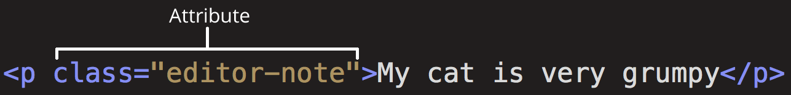

# HTML elements

HTML is HyperText Markup Language. HTML is parsed permissively because when the web was first created, it was decided that allowing people to get their content published was more important than making sure the syntax was absolutely correct.

## Anatomy of an HTML element

## Categorized according to nestable

- nesting elements
- void elements: `area, base, br, col, embed, hr, img, input, link, meta, source, track, wbr`

## Categorized according to block or not

In CSS, content that participates in block layout is called block-level content.
In CSS, content that participates in inline layout is called inline-level content.

- block(In a block layout, boxes are laid out one after the other, vertically, beginning at the top of a containing block.)
- inline-block
- inline

### Self-closing tags

Self-closing tags (`<tag />`) do not exist in HTML.
If a trailing / (slash) character is present in the start tag of an HTML element, HTML parsers ignore that slash character.
Self-closing tags are required in void elements in XML, XHTML, and SVG.

## Categorized according to function

### document

`<!DOCTYPE html>, html, head, base, meta, title, style, link, script, template, noscript, body`

The head's content is not displayed on the page. Instead, the head's job is to contain metadata about the document.

### Marking up text

- headings: `h1, h2, h3, h4, h5, h6, hgroup`
- paragraphs: `p`
- emphasis and importance: `span, em, strong, i, b, u`
- quotations: blockquote, `q`(inline quotation)
- abbreviations: `abbr`
- description lists: `dl, dt, dd`
- links: `a`
- lists: `ol, ul, li`
- computer code: `code, pre, var, kbd, samp`
- contact details: `address`
- Superscript and subscript: `sup, sub`
- times and dates: `time`

### structure

- header(usually a big strip across the top with a big heading, logo, and perhaps a tagline)
  - `header`
- navigation bar(links to the site's main sections)
  - `nav`
- main content(a big area in the center that contains most of the unique content of a given webpage)
  - `main, article, section, div`
- sidebar(peripheral info, links, quotes, ads)
  - `aside`
- footer(a strip across the bottom of the page that generally contains fine print, copyright notices, or contact info)
  - `footer`
- non-semantic element(sometimes you'll come across a situation where you can't find an ideal semantic element to group some items together or wrap some content)
  - `div, span`
- Line breaks and horizontal
  - `br, hr`

#### table

`table, caption, colgroup, col thead, tbody, tfoot, tr, th, td`

### form

`form, label, input, textarea, select, button, fieldset, meter, output, progress, object`

### media

- image: `img, figure, figcaption, picture, source, map, area`
- video & audio: `video, audio, source, track`
- Scalable Vector Graphics: `svg`
- canvas: `canvas`
- other embedding technologies: `object, embed`(*out of fashion*), `iframe`

### Transparent content model

`del, ins`

## Details of each element

### `a` inline

The `<a>` HTML element (or anchor element), with its `href` attribute, creates a hyperlink to web pages, files, email addresses, locations in the same page, or anything else a URL can address.

Anchor elements are often abused as fake buttons by setting their `href` to `#` or `javascript:void(0)` to prevent the page from refreshing, then listening for their click events.

Use a `<button>` instead. In general, you should only use a hyperlink for navigation to a real URL.

Permitted parents are any element that accepts flow content, but not other `<a>` elements.

#### attributes

- download
- href(hypertext reference)
- target: `_self, _blank, _parent, _top, _unfencedTop`
- referrerpolicy: `no-referrer, origin, origin-when-cross-origin, same-origin, strict-origin, strict-origin-when-cross-origin, unsafe-url`
- hreflang
- ping
- type
- rel(relationship)

#### DOM interface: HTMLAnchorElement

- download
- hash
- host
- hostname
- href
- hreflang
- origin
- password
- pathname
- ping
- port
- protocol
- referrerPolicy
- rel
- relList
- search
- target
- text
- type
- username

### `abbr` inline

represents an abbreviation or acronym

#### attributes

- title

#### DOM interface: HTMLElement

### `acronym` Deprecated

### `address`

provides contact information

The `<address>` element can only be used to represent the contact information for its nearest `<article>` or `<body>` element ancestor.

#### DOM interface: HTMLSpanElement

### `area`

defines an area inside an image map that has predefined clickable areas

The `<area>` element must have an ancestor `<map>`, but it need not be a direct parent.

#### attributes

- alt
- coords(coordinates)
- download
- href
- ping
- referrerpolicy
- rel
- shape
- target

#### DOM interface: HTMLAreaElement

### `article`

represents a self-contained composition in a document, page, application, or site, which is intended to be independently distributable or reusable

Note that an <article> element must not be a descendant of an <address> element.

#### DOM interface: 	HTMLElement

### `aside`

represents a portion of a document whose content is only indirectly related to the document's main content

#### DOM interface: HTMLElement

### `audio`

Used to embed sound content in documents. It may contain one or more audio sources, represented using the src attribute or the `<source>` element: the browser will choose the most suitable one. It can also be the destination for streamed media, using a MediaStream.

#### attributes

- autoplay
- controls
- loop
- muted
- preload
- src
- controlslist
- crossorigin
- anonymous
- use-credentials
- disableremoteplayback

#### Events

- audioprocess: The input buffer of a ScriptProcessorNode is ready to be processed.
- canplay: The browser can play the media, but estimates that not enough data has been loaded to play the media up to its end without having to stop for further buffering of content.
- canplaythrough: The browser estimates it can play the media up to its end without stopping for content buffering.
- complete: The rendering of an OfflineAudioContext is terminated.
- durationchange: The duration attribute has been updated.
- emptied: The media has become empty; for example, this event is sent if the media has already been loaded (or partially loaded), and the HTMLMediaElement.load method is called to reload it.
- ended: Playback has stopped because the end of the media was reached.
- loadeddata: The first frame of the media has finished loading.
- loadedmetadata: The metadata has been loaded.
- loadstart: Fired when the browser has started to load the resource.
- pause: Playback has been paused.
- play: Playback has begun.
- playing: Playback is ready to start after having been paused or delayed due to lack of data.
- ratechange: The playback rate has changed.
- seeked: A seek operation completed.
- seeking: A seek operation began.
- stalled: The user agent is trying to fetch media data, but data is unexpectedly not forthcoming.
- suspend: Media data loading has been suspended.
- timeupdate: The time indicated by the currentTime attribute has been updated.
- volumechange: The volume has changed.
- waiting: Playback has stopped because of a temporary lack of data

#### DOM interface: HTMLAudioElement

### `b` Bring Attention

used to draw the reader's attention to the element's contents, which are not otherwise granted special importance. This was formerly known as the Boldface element, and most browsers still draw the text in boldface. However, you should not use `<b>` for styling text or granting importance.  If you wish to indicate an element is of special importance, you should use the `<strong>` element.

#### DOM interface: HTMLElement

### `base`

specifies the base URL to use for all relative URLs in a document. There can be only one `<base>` element in a document.

A `<base>` element must have an href attribute, a target attribute, or both.

A document's used base URL can be accessed by scripts with `Node.baseURI`. If the document has no `<base>` elements, then baseURI defaults to location.href.

#### attributes

- href
- target

#### DOM interface: HTMLBaseElement

### `bdi` Bidirectional Isolate

Tells the browser's bidirectional algorithm to treat the text it contains in isolation from its surrounding text. It's particularly useful when a website dynamically inserts some text and doesn't know the directionality of the text being inserted.

Bidirectional text is text that may contain both sequences of characters that are arranged left-to-right (LTR) and sequences of characters that are arranged right-to-left (RTL), such as an Arabic quotation embedded in an English string.

#### attributes

- dir(direction)

#### DOM interface: HTMLElement

### `bdo` Bidirectional Text Override

overrides the current directionality of text, so that the text within is rendered in a different direction.

#### attributes

- dir

#### DOM interface: HTMLSpanElement

### `big` Deprecated

### `blockquote` Block Quotation

indicates that the enclosed text is an extended quotation

#### attributes

- cite

#### DOM interface: HTMLQuoteElement

### `body`

represents the content of an HTML document. There can be only one `<body>` element in a document.

#### attributes

- onafterprint
- onbeforeprint
- onbeforeunload
- onblur
- onerror
- onfocus
- onhashchange
- onlanguagechange
- onload
- onmessage
- onoffline
- ononline
- onpopstate
- onresize
- onstorage
- onunload

#### DOM interface: HTMLBodyElement

- document.body

### `br`

produces a line break in text (carriage-return)

#### DOM interface: HTMLBRElement

### `button`

An interactive element activated by a user with a mouse, keyboard, finger, voice command, or other assistive technology.

#### attributes

autofocus
disabled
form
name
value
type: `submit,reset,button`
formaction
formenctype: `application/x-www-form-urlencoded(default), multipart/form-data, text/plain`
formmethod: `post, get, dialog`
formnovalidate
formtarget
popovertarget
popovertargetaction

#### DOM interface: HTMLButtonElement

- disabled
- labels
- type
- popoverTargetAction
- popoverTargetElement

### `canvas`

You should provide alternate content inside the `<canvas>` block. That content will be rendered both on older browsers that don't support canvas and in browsers with JavaScript disabled.

A canvas can be rendered using the `OffscreenCanvas` API where the document and canvas are decoupled. The benefit is that a worker thread can handle canvas rendering and the main thread of your web application is not blocked by canvas operations.

#### attributes

- height
- width

#### DOM interface: HTMLCanvasElement

### `caption` Table Caption

 specifies the caption (or title) of a table, providing the table an accessible description.

 If included, the `<caption>` element must be the first child of its parent `<table>` element.

 When a `<table>` is nested within a `<figure>` as the figure's only content, it should be captioned via a `<figcaption>` for the `<figure>` instead of as a `<caption>` nested within the `<table>`.

Any background-color applied to a table will not be applied to its caption.

#### DOM interface: HTMLTableCaptionElement

### `center` Deprecated

### `cite`

 used to mark up the title of a cited creative work

#### DOM interface: HTMLSpanElement

### `code`

displays its contents styled in a fashion intended to indicate that the text is a short fragment of computer code. By default, the content text is displayed using the user agent's default monospace font.

#### DOM interface: HTMLSpanElement

### `col`

defines one or more columns in a column group represented by its parent `<colgroup>` element. The `<col>` element is only valid as a child of a `<colgroup>` element that has no span attribute defined.

#### DOM interface: HTMLTableColElement

### `colgroup`

defines a group of columns within a table.

The `<colgroup>` should appear within a `<table>`, after any `<caption>` element (if used), but before any `<thead>`, `<tbody>`, `<tfoot>`, and `<tr>` elements.

#### attributes

- span

#### DOM interface: HTMLTableColElement

### `data`

links a given piece of content with a machine-readable translation. If the content is time- or date-related, the `<time>` element must be used.

#### attributes

- value

#### DOM interface: HTMLDataElement

### `datalist`

contains a set of `<option>` elements that represent the permissible or recommended options available to choose from within other controls.

#### DOM interface: HTMLDataListElement

### `del`

 represents a range of text that has been deleted from a document. This can be used when rendering "track changes" or source code diff information.

#### attributes

- cite
- datetime

#### DOM interface: HTMLModElement

### `details` Details disclosure

 creates a disclosure widget in which information is visible only when the widget is toggled into an "open" state. A summary or label must be provided using the `
` element.

#### attributes

- open
- name: This attribute enables multiple `
` elements to be connected, with only one open at a time.

#### events

- toggle

#### DOM interface: 	HTMLDetailsElement

### `dfn` Definition

 indicates a term to be defined.

- The ancestor paragraph (a block of text, sometimes marked by a `
` element)
- The `<dt>/<dd>` pairing
- The nearest section ancestor of the `<dfn>` element,

#### attributes

- title

#### DOM interface: HTMLElement

### `dialog` 2022

The HTML `<dialog>` element is used to create both modal and non-modal dialog boxes. Modal dialog boxes interrupt interaction with the rest of the page being inert, while non-modal dialog boxes allow interaction with the rest of the page.

Using ::backdrop pseudo-element to set backdrop when then modal is opened.

#### attributes

- open: It is recommended to use the .show() or .showModal() method to render dialogs, rather than the open attribute. If a `<dialog>` is opened using the open attribute, it is non-modal.

#### DOM interface: HTMLDialogElement

### `dir` Deprecated

### `div`

generic container for flow content.

#### DOM interface: HTMLDivElement

### `dl` Description List
represents a description list. The element encloses a list of groups of terms (specified using the `<dt>` element) and descriptions (provided by `<dd>` elements). Common uses for this element are to implement a glossary or to display metadata (a list of key-value pairs).

#### DOM interface: HTMLDListElement

### `dt` Description Term

#### DOM interface: HTMLSpanElement

### `dd` Description Details

provides the description, definition, or value for the preceding term (`<dt>`) in a description list (`<dl>`).

#### DOM interface: HTMLElement

### `em` Emphasis

marks text that has stress emphasis. The `<em>` element can be nested, with each level of nesting indicating a greater degree of emphasis.

#### DOM interface: HTMLSpanElement

### `embed` Embed External Content

#### DOM interface: HTMLEmbedElement

### `fencedframe` Experimental

### `fieldset`

used to group several controls as well as labels within a web form. Use with legend.

#### attributes

- disabled
- form
- name

#### DOM interface: HTMLFieldSetElement

### `figcaption`

represents a caption or legend describing the rest of the contents of its parent `<figure>` element, providing the `<figure>` an accessible description.

#### DOM interface: HTMLElement

### `figure`

represents self-contained content, potentially with an optional caption, which is specified using the `<figcaption>` element. The figure, its caption, and its contents are referenced as a single unit.

#### DOM interface: HTMLElement

### `font` Deprecated

### `footer`

represents a footer for its nearest ancestor sectioning content or sectioning root element. A `<footer>` typically contains information about the author of the section, copyright data or links to related documents.

#### DOM interface: HTMLElement

### `form`

represents a document section containing interactive controls for submitting information.

#### attributes

- accept-charset
- autocapitalize

#### DOM interface:

### `frame` Deprecated

#### attributes

-

#### DOM interface:

### `frameset` Deprecated

#### attributes

-

#### DOM interface:

### `h1`

#### attributes

-

#### DOM interface:

### `head`

#### attributes

-

#### DOM interface:

### `header`

#### attributes

-

#### DOM interface:

### `hgroup`

#### attributes

-

#### DOM interface:

### `hr`

#### attributes

-

#### DOM interface:

### `html`

#### attributes

-

#### DOM interface:

### `i`

#### attributes

-

#### DOM interface:

### `iframe`

#### attributes

-

#### DOM interface:

### `img`

#### attributes

-

#### DOM interface:

### `input`

#### attributes

-

#### DOM interface:

### `ins`

#### attributes

-

#### DOM interface:

### `kbd`

#### attributes

-

#### DOM interface:

### `label`

#### attributes

-

#### DOM interface:

### `legend`

#### attributes

-

#### DOM interface:

### `li`

#### attributes

-

#### DOM interface:

### `link`

#### attributes

-

#### DOM interface:

### `main`

#### attributes

-

#### DOM interface:

### `map`

#### attributes

-

#### DOM interface:

### `mark`

#### attributes

-

#### DOM interface:

### `marquee` Deprecated

#### attributes

-

#### DOM interface:

### `menu`

#### attributes

-

#### DOM interface:

### `menuitem` Non-standardDeprecated

#### attributes

-

#### DOM interface:

### `meta`

#### attributes

-

#### DOM interface:

### `meter`

#### attributes

-

#### DOM interface:

### `nav`

#### attributes

-

#### DOM interface:

### `nobr` Deprecated

#### attributes

-

#### DOM interface:

### `noembed` Deprecated

#### attributes

-

#### DOM interface:

### `noframes` Deprecated

#### attributes

-

#### DOM interface:

### `noscript`

#### attributes

-

#### DOM interface:

### `object`

#### attributes

-

#### DOM interface:

### `ol`

#### attributes

-

#### DOM interface:

### `optgroup`

#### attributes

-

#### DOM interface:

### `option`

#### attributes

-

#### DOM interface:

### `output`

#### attributes

-

#### DOM interface:

### `p`

#### attributes

-

#### DOM interface:

### `param` Deprecated

#### attributes

-

#### DOM interface:

### `picture`

#### attributes

-

#### DOM interface:

### `plaintext` Deprecated

#### attributes

-

#### DOM interface:

### `portal` Experimental

#### attributes

-

#### DOM interface:

### `pre`

#### attributes

-

#### DOM interface:

### `progress`

#### attributes

-

#### DOM interface:

### `q`

#### attributes

-

#### DOM interface:

### `rb` Deprecated

#### attributes

-

#### DOM interface:

### `rp`

#### attributes

-

#### DOM interface:

### `rt`

#### attributes

-

#### DOM interface:

### `rtc` Deprecated

#### attributes

-

#### DOM interface:

### `ruby`

#### attributes

-

#### DOM interface:

### `s`

#### attributes

-

#### DOM interface:

### `samp`

#### attributes

-

#### DOM interface:

### `script`

#### attributes

-

#### DOM interface:

### `search`

#### attributes

-

#### DOM interface:

### `section`

#### attributes

-

#### DOM interface:

### `select`

#### attributes

-

#### DOM interface:

### `slot`

#### attributes

-

#### DOM interface:

### `small`

#### attributes

-

#### DOM interface:

### `source`

#### attributes

-

#### DOM interface:

### `span`

#### attributes

-

#### DOM interface:

### `strike` Deprecated

#### attributes

-

#### DOM interface:

### `strong`

#### attributes

-

#### DOM interface:

### `style`

#### attributes

-

#### DOM interface:

### `sub`

#### attributes

-

#### DOM interface:

### `summary`

#### attributes

-

#### DOM interface:

### `sup`

#### attributes

-

#### DOM interface:

### `table`

#### attributes

-

#### DOM interface:

### `tbody`

#### attributes

-

#### DOM interface:

### `td`

#### attributes

-

#### DOM interface:

### `template`

#### attributes

-

#### DOM interface:

### `textarea`

#### attributes

-

#### DOM interface:

### `tfoot`

#### attributes

-

#### DOM interface:

### `th`

#### attributes

-

#### DOM interface:

### `thead`

#### attributes

-

#### DOM interface:

### `time`

#### attributes

-

#### DOM interface:

### `title`

#### attributes

-

#### DOM interface:

### `tr`

#### attributes

-

#### DOM interface:

### `track`

#### attributes

-

#### DOM interface:

### `tt` Deprecated

#### attributes

-

#### DOM interface:

### `u`

#### attributes

-

#### DOM interface:

### `ul`

#### attributes

-

#### DOM interface:

### `var`

#### attributes

-

#### DOM interface:

### `video`

#### attributes

-

#### DOM interface:

### `wbr`

#### attributes

-

#### DOM interface:

### `xmp` Deprecated

#### attributes

-

#### DOM interface:

### `svg`

- **Pros**
  - Putting your SVG inline saves an HTTP request, and therefore can reduce your loading time a bit.
  - You can assign classes and ids to SVG elements and style them with CSS, either within the SVG or wherever you put the CSS style rules for your HTML document. In fact, you can use any SVG presentation attribute as a CSS property.
  - Inlining SVG is the only approach that lets you use CSS interactions (like :focus) and CSS animations on your SVG image (even in your regular stylesheet.)
  - You can make SVG markup into a hyperlink by wrapping it in an `<a>` element.

- **Cons**
  - This method is only suitable if you're using the SVG in only one place. Duplication makes for resource-intensive maintenance.
  - Extra SVG code increases the size of your HTML file.
  - The browser cannot cache inline SVG as it would cache regular image assets, so pages that include the image will not load faster after the first page containing the image is loaded.
  - You may include fallback in a `<foreignObject>` element, but browsers that support SVG still download any fallback images. - You need to weigh whether the extra overhead is really worthwhile, just to support obsolescent browsers.

## Q & A

**Q: Why do we need structure?**

- Users looking at a web page tend to scan quickly to find relevant content, often just reading the headings, to begin with.
- Search engines indexing your page consider the contents of headings as important keywords for influencing the page's search rankings. SEO (Search Engine Optimization)
- Severely visually impaired people often don't read web pages; they listen to them instead. This is done with software called a screen reader. This software provides ways to get fast access to given text content.
- To style content with CSS, or make it do interesting things with JavaScript, you need to have elements wrapping the relevant content, so CSS/JavaScript can effectively target it.

**Q: Why do we need semantics?**

Semantics are relied on everywhere around us—we rely on previous experience to tell us what the function of an everyday object is;
